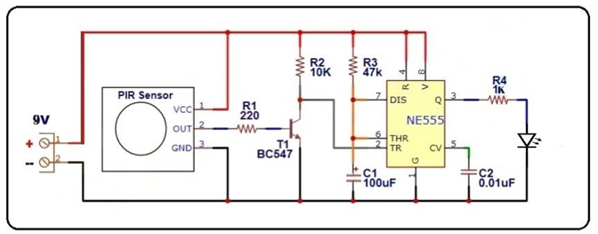
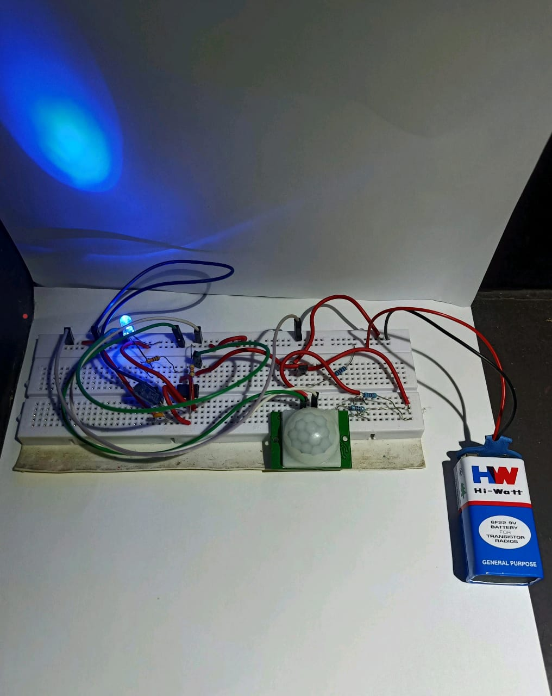

# 💡 Motion Activated Light using PIR Sensor and 555 Timer

## Overview

This project implements an **automatic motion-activated lighting system** using a PIR (Passive Infrared) sensor and a 555 Timer IC.

The system detects human movement and automatically switches ON a light for a predefined duration, demonstrating practical applications of analog electronics and sensor-based automation.

---

## 🎯 Objective

To design a low-cost automatic lighting system that activates a load when motion is detected.

---

## ⚙️ Working Principle

* The **PIR sensor** detects infrared radiation changes caused by human motion.
* The output signal triggers a **555 Timer IC** configured in **monostable mode**.
* The timer generates a pulse that keeps the light ON for a fixed time interval.
* After the delay period, the system automatically turns OFF.

---

## 🔧 Concepts Used

* PIR Motion Sensing
* 555 Timer Monostable Operation
* Analog Timing Circuits
* Sensor-based Automation

---

## 🖼️ Circuit Diagram



---

## 🧪 Prototype



---

## 🧩 Hardware Components

* PIR Sensor
* NE555 Timer IC
* Resistors & Capacitors
* Relay / LED Load
* Power Supply

---

## 📁 Repository Structure

```id="n6jqv3"
motion-activated-light-555-pir/
│
├── images/
│   ├── circuit_diagram.png
│   └── prototype.jpg
│
├── docs/
│   └── project_report.pdf
│
├── README.md
└── LICENSE
```

---

## 👨‍💻 Team

* Hashim S N
* Joshua Felix
* Siddharth S Krishnan
* Vibhu V

---

## 🎓 Academic Context

Developed as a Discrete Electronics project demonstrating practical implementation of sensor-triggered analog control circuits.

---

## 📄 License

MIT License — for academic and learning purposes.
